<p align="center">
  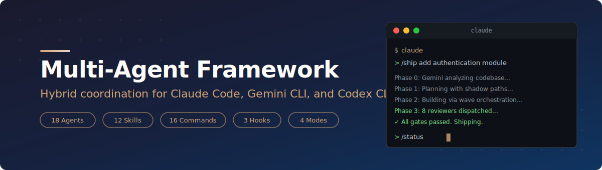
</p>

<p align="center">
  <strong>Hybrid multi-agent coordination where Claude Code orchestrates Gemini CLI, Codex CLI, and specialized subagents through file-based protocols, portable skills, and parallel review swarms.</strong>
</p>

<p align="center">
  <a href="#what-is-this">Overview</a> ·
  <a href="#project-structure">Structure</a> ·
  <a href="#sprint-pipeline-ship">Pipeline</a> ·
  <a href="#planning-pipeline-plan">Plan</a> ·
  <a href="#deep-research-deep-research">Research</a> ·
  <a href="#wave-orchestration-build">Build</a> ·
  <a href="#review-swarm-review">Review</a> ·
  <a href="#test-pipeline-test">Test</a> ·
  <a href="#debugging-debug">Debug</a> ·
  <a href="#quality-gates">Gates</a> ·
  <a href="#context-recovery">Context</a> ·
  <a href="#getting-started">Quick Start</a> ·
  <a href="#commands-reference">Commands</a> ·
  <a href="#faq">FAQ</a>
</p>

---

## What is this?

A production-grade framework that turns Claude Code into a **lead agent** coordinating multiple AI systems. Instead of using one model for everything, this framework assigns each model to what it does best:

- **[Claude Code](https://docs.anthropic.com/en/docs/claude-code) (Opus)** builds features and orchestrates the entire workflow
- **[Gemini CLI](https://github.com/google-gemini/gemini-cli)** performs full-codebase analysis using its 1M token context window
- **[Codex CLI](https://github.com/openai/codex)** runs tests, security audits, and infrastructure tasks in sandboxed environments
- **Claude specialized agents** provide deep expertise in [security](agents/security-sentinel.md), [performance](agents/performance-oracle.md), [architecture](agents/architecture-strategist.md), and more

Every interaction between agents follows a structured protocol. Work is tracked in shared markdown files. Reviews run in parallel. Knowledge compounds across sessions.

> *Each sprint should make the next sprint easier — not harder.*

The framework achieves this through **institutional knowledge compounding**: every non-trivial problem solved gets documented in [`ops/solutions/`](ops/solutions/), every architectural decision in [`ops/decisions/`](ops/decisions/), and a [`learnings-researcher`](agents/learnings-researcher.md) agent automatically searches these before planning new work.

<p align="center">
  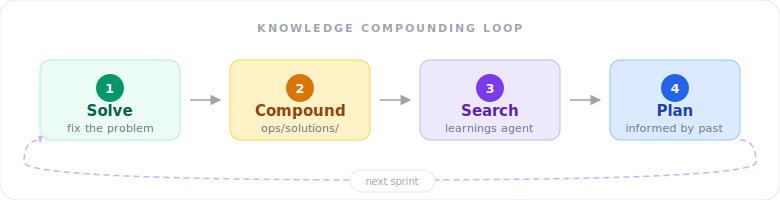
</p>

---

## What's new (v2.0.0)

### Claude Code plugin

The framework is now a **Claude Code plugin** — install with one command, update with one command. No more git clone, no manual file copying, no `.claude/settings.json` editing.

```bash
claude plugin add https://github.com/Ninety2UA/multi-agent-framework
```

All agents, skills, commands, and hooks register automatically. Your project's `ops/` directory is bootstrapped on first session.

### Ship-loop rewrite (Blueprint alignment)

The Stop hook was rewritten to match the [Claude Code Blueprint](https://github.com/Ninety2UA/claude-code-blueprint)'s architecture:

- **JSON output** `{decision, reason, systemMessage}` — re-injects the original goal on each iteration
- **Session isolation** — only blocks the session that started the sprint via `session_id` matching
- **Transcript-based promise detection** — reads the actual JSONL transcript to find `<promise>DONE</promise>`
- **JSON-safe encoding** — uses `python3 json.dumps()` so goals with quotes/newlines don't break the output
- **Atomic state updates** — temp file + `mv` instead of `sed -i`

### Four-pass audit (20 agents)

Every component in the framework was reviewed by parallel audit agents across 4 passes, converging from **5 critical issues to zero**:

| Pass | Issues found | Key fixes |
|---|---|---|
| 1st | 4 critical, 10 high | Hooks were reading non-existent env vars (stdin JSON fix), README shipped broken config |
| 2nd | 1 critical, 8 high | JSON injection in ship-loop, missing PID captures, path consistency |
| 3rd | 3 critical, 7 high | Post-migration stale docs, `mkdir .claude` guards, deep-research PID |
| 4th | 1 high | Last hook missing `mkdir` guard |

Plus a manual 11-point verification: bash syntax, JSON validity, stale path scans, file counts, executable permissions, `mkdir` guards, stdin parsing, agent cross-references, plugin hook paths, and state file template compatibility.

### Automatic project bootstrapping

On first session in a new project, the `session-start.sh` hook:
- Creates `ops/solutions/`, `ops/decisions/`, `ops/archive/`
- Copies skeleton `MEMORY.md` and `CHANGELOG.md` from plugin templates
- Suggests copying the `CLAUDE.md` template if not present
- Creates `.claude/` directory for session state files

---

## Project structure

The plugin provides agents, skills, commands, and hooks. Your project gets an `ops/` directory for state:

```
multi-agent-framework/              (plugin — installed automatically)
├── .claude-plugin/plugin.json        Plugin manifest
├── agents/                           18 specialized agent definitions
├── skills/                           12 portable workflow modules
├── commands/                         16 slash commands
├── hooks/
│   ├── hooks.json                    Hook registration
│   └── handlers/                     3 lifecycle hook scripts
├── settings.json                     Default env vars
├── templates/                        Project bootstrapping templates
└── scripts/coordinate.sh            Outer loop for context recovery

your-project/                       (your repo — bootstrapped on first session)
├── CLAUDE.md                         Orchestration protocol (copy from template)
├── ops/                              Shared coordination files
│   ├── MEMORY.md                       Decisions, patterns, gotchas
│   ├── CHANGELOG.md                    Audit trail with agent attribution
│   ├── STATE.md                        Session continuity checkpoint
│   ├── solutions/                      Documented solved problems
│   ├── decisions/                      Architecture decision records
│   └── archive/                        Archived review + test files
└── src/                              Your source code
```

### Shared file protocol

All agents coordinate through markdown files in [`ops/`](ops/). This is the source of truth:

| File | Purpose | Owner |
|---|---|---|
| `TASKS.md` (runtime) | Work queue with `[ ]`/`[x]` status tracking | Claude generates, all agents read |
| [`MEMORY.md`](ops/MEMORY.md) | Architectural decisions, patterns, interface proposals | All agents append |
| [`CHANGELOG.md`](ops/CHANGELOG.md) | Audit trail with `[agent-name]` attribution | All agents append |
| [`STATE.md`](ops/STATE.md) | Session continuity — current phase, progress, next actions | Claude writes on pause/wrap |
| [`solutions/`](ops/solutions/) | Documented solved problems for institutional knowledge | Claude writes via [`/compound`](commands/compound.md) |
| [`decisions/`](ops/decisions/) | Architecture decision records (ADRs) | Claude writes via [`/compound`](commands/compound.md) |

---

## Sprint Pipeline (`/ship`)

Every goal flows through a structured pipeline. Run [`/ship`](commands/ship.md) for fully autonomous execution, or invoke each phase individually.

<p align="center">
  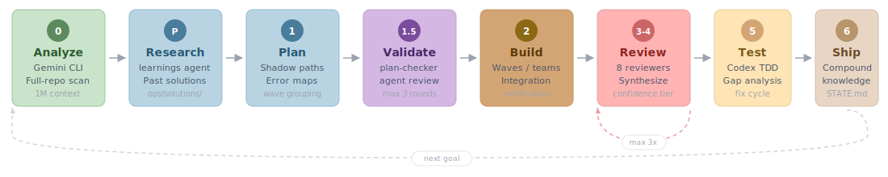
</p>

| Phase | What happens | Agent(s) | Command |
|:---|:---|:---|:---|
| **0 — Analyze** | Full-repo scan: architecture, patterns, contracts, debt | Gemini CLI + [`codebase-mapping`](skills/codebase-mapping/SKILL.md) | [`/plan`](commands/plan.md) |
| **Pre-Plan** | Search institutional knowledge for relevant past solutions | [`learnings-researcher`](agents/learnings-researcher.md) | [`/plan`](commands/plan.md) |
| **1 — Plan** | Decompose goal into tasks with shadow paths and error maps | Claude + [`writing-plans`](skills/writing-plans/SKILL.md) | [`/plan`](commands/plan.md) |
| **1.5 — Validate** | Validate assignments, dependencies, scope, shadow paths | [`plan-checker`](agents/plan-checker.md) | [`/plan`](commands/plan.md) |
| **2 — Build** | Wave orchestration with integration verification between waves | Claude subagents or [`team-lead`](agents/team-lead.md) | [`/build`](commands/build.md) |
| **3–4 — Review** | Up to 7 parallel reviewers, synthesized with confidence tiering | Gemini + Codex + [review agents](#review-specialists-6) | [`/review`](commands/review.md) |
| **5 — Test** | TDD test writing, gap analysis, fix cycle until green | Codex CLI + [`test-driven-development`](skills/test-driven-development/SKILL.md) | [`/test`](commands/test.md) |
| **6 — Ship** | Document solutions, archive reviews, write STATE.md | Claude + [`knowledge-compounding`](skills/knowledge-compounding/SKILL.md) | [`/wrap`](commands/wrap.md) |

---

## Planning Pipeline (`/plan`)

Analyzes the full codebase with Gemini's 1M context, searches institutional knowledge, decomposes the goal with shadow paths and error maps, then validates via [`plan-checker`](agents/plan-checker.md).

<p align="center">
  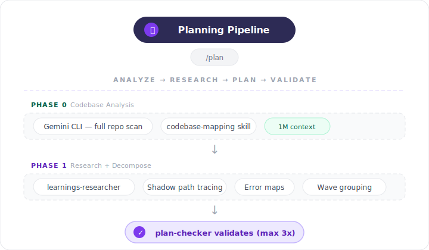
</p>

---

## Deep Research (`/deep-research`)

Spawns 5 research agents in parallel before planning, then synthesizes findings into a unified research brief.

<p align="center">
  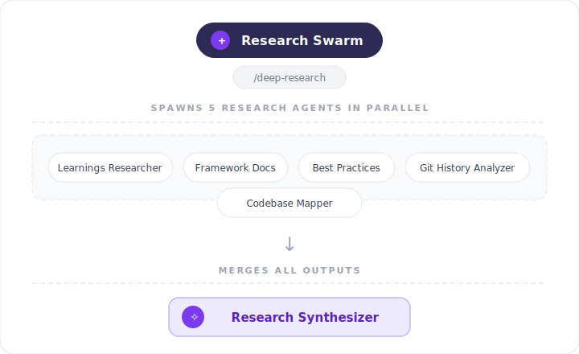
</p>

---

## Wave Orchestration (`/build`)

Groups plan tasks by dependency into waves. Independent tasks within each wave run in parallel; an [`integration-verifier`](agents/integration-verifier.md) validates between waves.

<p align="center">
  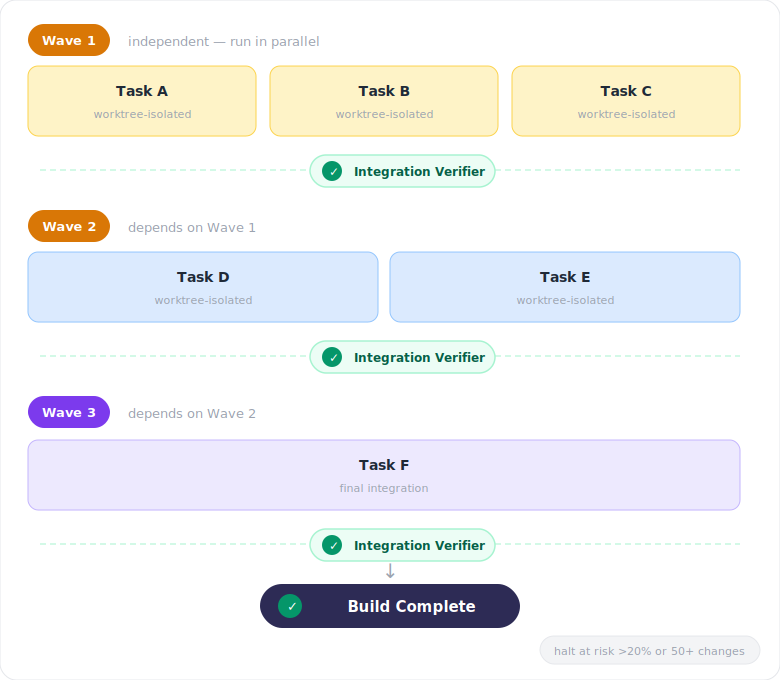
</p>

---

## Four coordination modes

| Mode | Mechanism | When to use |
|---|---|---|
| **File-based** | Shared markdown in [`ops/`](ops/) | Persistent state across sessions, audit trails |
| **Direct invocation** | `gemini -p` / `codex exec` via bash | Real-time external agent delegation |
| **Native subagents** | Claude's Agent tool with [`agents/`](agents/) definitions | Parallel focused tasks, review swarms |
| **Agent teams** | Multi-Claude with shared task lists ([`team-lead`](agents/team-lead.md)) | Complex builds with 5+ interdependent tasks |

### Portable skill injection

Skills are model-agnostic markdown files that ANY agent can consume. This decouples *what methodology to use* from *which model executes it*:

```bash
# Claude uses skills natively (via commands and agent definitions)

# Gemini receives skills via prompt injection
gemini -p "$(cat ${CLAUDE_PLUGIN_ROOT}/skills/codebase-mapping/SKILL.md) Analyze the full codebase..."

# Codex receives skills the same way
codex exec "$(cat ${CLAUDE_PLUGIN_ROOT}/skills/test-driven-development/SKILL.md) Write tests for..."
```

### Assignment heuristic

| Question | Agent |
|---|---|
| Produces code? | Claude (subagents or [agent team](agents/team-lead.md) for parallel work) |
| Evaluates existing code? | [Gemini](https://github.com/google-gemini/gemini-cli) + [Codex](https://github.com/openai/codex) + [Claude review agents](#review-specialists-6) in parallel |
| Runs/executes something? | [Codex CLI](https://github.com/openai/codex) |
| Produces documentation? | [Gemini CLI](https://github.com/google-gemini/gemini-cli) |
| Touches shared interfaces? | Claude implements → Gemini reviews → Codex tests |
| Ambiguous? | Claude takes it, flags for parallel review |

---

## Review Swarm (`/review`)

Up to 7 reviewers analyze the same code simultaneously through different lenses (2 external CLIs + 5 Claude specialized agents with `--full`), then a [`findings-synthesizer`](agents/findings-synthesizer.md) merges, deduplicates, and priority-ranks all findings.

<p align="center">
  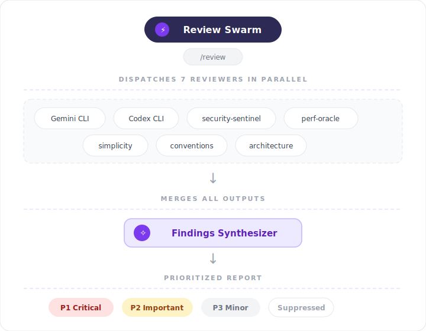
</p>

### Confidence tiering

Every finding gets a confidence score to prevent wasting time on phantom issues:

| Tier | Criteria | Rule |
|---|---|---|
| **HIGH** | Verified in codebase via grep/read. Deterministic. | Can be any priority |
| **MEDIUM** | Pattern-aggregated detection. Some false positive risk. | Can be any priority |
| **LOW** | Requires intent verification. Heuristic-only. | **Can NEVER be P1** |

### Suppressions

Each reviewer has a "Do Not Flag" list to reduce noise — readability-aiding redundancy, documented thresholds, sufficient test assertions, consistency-only style changes, and issues already addressed in the current diff. See individual [agent definitions](agents/) for each reviewer's suppressions list.

---

## Test Pipeline (`/test`)

Identifies untested code paths with [`test-gap-analyzer`](agents/test-gap-analyzer.md), then writes and runs tests via [Codex CLI](https://github.com/openai/codex) using the TDD skill in a sandboxed environment.

<p align="center">
  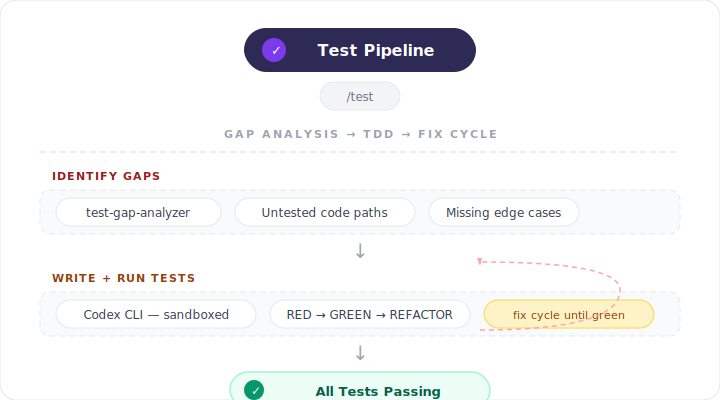
</p>

---

## Debugging (`/debug`)

Structured debugging with [`systematic-debugging`](skills/systematic-debugging/SKILL.md): reproduce the bug first, perform root cause analysis, then fix with evidence.

<p align="center">
  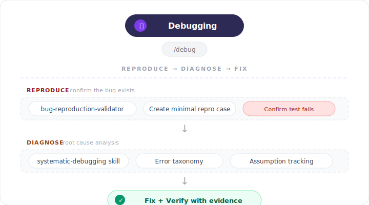
</p>

---

## Quality Gates

Five non-negotiable checkpoints enforced at every stage:

<p align="center">
  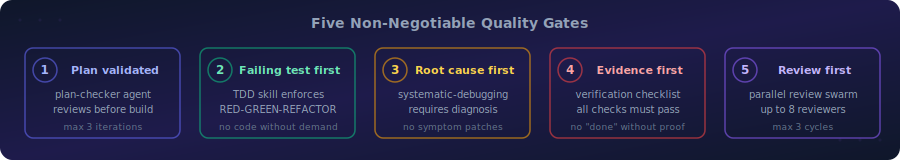
</p>

| Gate | Enforced by | Rule |
|---|---|---|
| **1 — Plan validated** | [`plan-checker`](agents/plan-checker.md) agent | No build without validated plan (max 3 iterations) |
| **2 — Failing test first** | [`test-driven-development`](skills/test-driven-development/SKILL.md) skill | No production code without a failing test |
| **3 — Root cause first** | [`systematic-debugging`](skills/systematic-debugging/SKILL.md) skill | No fix without diagnosis |
| **4 — Evidence first** | [`verification-before-completion`](skills/verification-before-completion/SKILL.md) skill | No "done" without proof |
| **5 — Review first** | [`review-synthesis`](skills/review-synthesis/SKILL.md) skill | No merge without code review (max 3 cycles) |

---

## Getting started

### Prerequisites

All three CLIs must be installed and authenticated:

```bash
# Claude Code (you're probably already here)
claude --version

# Gemini CLI — https://github.com/google-gemini/gemini-cli
gemini -p "Respond with only: READY"

# Codex CLI — https://github.com/openai/codex
codex exec "Respond with only: READY"
```

### Installation

**Install as a Claude Code plugin:**

```bash
# User scope (available in all your projects)
claude plugin add https://github.com/Ninety2UA/multi-agent-framework

# Or project scope (shared with team via .claude/settings.json)
claude plugin add https://github.com/Ninety2UA/multi-agent-framework --scope project
```

That's it. No manual configuration needed — hooks, env vars, agents, skills, and commands are all registered automatically by the plugin system.

On first session, the plugin bootstraps your project's `ops/` directory and suggests copying the CLAUDE.md template.

### Update

```bash
claude plugin update multi-agent-framework
```

### Development (for contributors)

```bash
git clone https://github.com/Ninety2UA/multi-agent-framework.git
claude --plugin-dir ./multi-agent-framework
```

### Verify installation

```bash
claude

# You should see:
# "Multi-agent framework ready."
# "Commands: /ship /plan /build /review /test /debug /quick ..."

/status
```

### Typical session flow

**Supervised (human in the loop):**

```bash
claude
> /plan add user authentication         # Phase 0-1.5: analyze, research, plan, validate
> /build                                 # Phase 2: wave orchestration
> /review                                # Phase 3-4: parallel review + synthesis
> /test                                  # Phase 5: Codex TDD
> /compound JWT session handling         # Document solution for future sprints
> /wrap                                  # Phase 6: compound knowledge, write STATE.md
```

**Autonomous (fire and forget):**

```bash
# Inside Claude — single session, won't stop until done
claude
> /ship add user authentication with JWT refresh tokens

# From terminal — with context-exhaustion recovery
./scripts/coordinate.sh "add user authentication" --max 5 --team
```

---

## Commands reference

### Full pipeline

| Command | What it does |
|---|---|
| [**`/ship <goal>`**](commands/ship.md) | Fully autonomous end-to-end sprint with inner loop guard. Won't stop until done. |
| [**`/coordinate <goal>`**](commands/coordinate.md) | Same phases with exit guard — alternative entry point for the full lifecycle. |

### Phase-specific

| Command | Phase | What it does |
|---|---|---|
| [**`/plan <goal>`**](commands/plan.md) | 0 → 1.5 | Analyze codebase, plan with shadow paths, validate via [`plan-checker`](agents/plan-checker.md) |
| [**`/build`**](commands/build.md) | 2 | [Wave orchestration](skills/wave-orchestration/SKILL.md) build. `--team` for [agent team](agents/team-lead.md) mode. |
| [**`/review`**](commands/review.md) | 3 → 4 | Parallel review + [synthesis](agents/findings-synthesizer.md). `--full` for all 7 reviewers. |
| [**`/test`**](commands/test.md) | 5 | [Gap analysis](agents/test-gap-analyzer.md) + [Codex](https://github.com/openai/codex) TDD. `--gaps-only` to just identify gaps. |
| [**`/wrap`**](commands/wrap.md) | 6 | [Compound knowledge](skills/knowledge-compounding/SKILL.md), archive reviews, write [`STATE.md`](ops/STATE.md). |

### Lightweight workflows

| Command | What it does |
|---|---|
| [**`/quick <change>`**](commands/quick.md) | For changes touching < 3 files. Skips heavy machinery. |
| [**`/debug <bug>`**](commands/debug.md) | Structured [debugging](skills/systematic-debugging/SKILL.md): reproduce, diagnose, fix with root cause analysis. |

### Research and operations

| Command | What it does |
|---|---|
| [**`/deep-research <topic>`**](commands/deep-research.md) | Launch 5 parallel research agents + [`research-synthesizer`](agents/research-synthesizer.md). |
| [**`/analyze <url>`**](commands/analyze.md) | Deep compatibility analysis of an external repo. |
| [**`/status`**](commands/status.md) | Sprint overview: phase, tasks, blockers, available commands. |
| [**`/pause`**](commands/pause.md) | Quick checkpoint to [`STATE.md`](ops/STATE.md). |
| [**`/resume`**](commands/resume.md) | Continue from [`STATE.md`](ops/STATE.md) checkpoint. |
| [**`/compound`**](commands/compound.md) | Document a solved problem to [`ops/solutions/`](ops/solutions/) or decision to [`ops/decisions/`](ops/decisions/). |
| [**`/resolve-pr <PR#>`**](commands/resolve-pr.md) | Read GitHub PR comments and implement requested changes via [`pr-comment-resolver`](agents/pr-comment-resolver.md). |

---

## Skills reference

12 portable, model-agnostic workflow modules that any agent can consume. Skills are injected into external agents via `$(cat ${CLAUDE_PLUGIN_ROOT}/skills/SKILL/SKILL.md)`.

| Skill | Primary consumer | What it teaches the agent |
|---|---|---|
| [**`codebase-mapping`**](skills/codebase-mapping/SKILL.md) | [Gemini](https://github.com/google-gemini/gemini-cli) (Phase 0) | Full-repo analysis: structure, data flow, patterns, debt |
| [**`writing-plans`**](skills/writing-plans/SKILL.md) | Claude (Phase 1) | Task decomposition with shadow paths, error maps, interface context |
| [**`shadow-path-tracing`**](skills/shadow-path-tracing/SKILL.md) | Claude (Phase 1) | Enumerate every failure path alongside the happy path |
| [**`wave-orchestration`**](skills/wave-orchestration/SKILL.md) | Claude (Phase 2) | Dependency-grouped parallel execution with integration checks |
| [**`test-driven-development`**](skills/test-driven-development/SKILL.md) | [Codex](https://github.com/openai/codex) (Phase 5) | RED-GREEN-REFACTOR: no production code without failing test |
| [**`systematic-debugging`**](skills/systematic-debugging/SKILL.md) | Codex, Claude | Error taxonomy, assumption tracking, bisection, root cause |
| [**`iterative-refinement`**](skills/iterative-refinement/SKILL.md) | Claude (Phase 4) | Review-fix-review loops with convergence modes |
| [**`review-synthesis`**](skills/review-synthesis/SKILL.md) | Claude (Phase 4) | Merge multi-reviewer findings with confidence tiering |
| [**`verification-before-completion`**](skills/verification-before-completion/SKILL.md) | All agents | Evidence-based completion checklist |
| [**`knowledge-compounding`**](skills/knowledge-compounding/SKILL.md) | Claude (Phase 6) | Document solutions to [`ops/solutions/`](ops/solutions/) for future sprints |
| [**`session-continuity`**](skills/session-continuity/SKILL.md) | Claude | Save and resume via [`STATE.md`](ops/STATE.md) across sessions |
| [**`scope-cutting`**](skills/scope-cutting/SKILL.md) | Claude | Systematically cut scope by unblocking value and risk |

---

## Agents reference

18 agents in [`agents/`](agents/) with restricted tools and focused expertise. Each runs in its own context window.

### Core workflow (6)

| Agent | Phase | What it does |
|---|---|---|
| [**`plan-checker`**](agents/plan-checker.md) | 1.5 | Validates task plans for completeness, assignments, dependencies |
| [**`findings-synthesizer`**](agents/findings-synthesizer.md) | 4 | Merges review outputs with deduplication and confidence tiering |
| [**`integration-verifier`**](agents/integration-verifier.md) | 2 | Runs build, tests, lint between waves |
| [**`learnings-researcher`**](agents/learnings-researcher.md) | Pre-1 | Searches [`ops/solutions/`](ops/solutions/) and [`ops/decisions/`](ops/decisions/) for relevant patterns |
| [**`team-lead`**](agents/team-lead.md) | 2 | Orchestrates agent team workers with file ownership and quality gates |
| [**`research-synthesizer`**](agents/research-synthesizer.md) | 0 | Merges parallel research outputs into unified analysis |

### Review specialists (6)

| Agent | Lens | What it catches |
|---|---|---|
| [**`security-sentinel`**](agents/security-sentinel.md) | Security | SQL injection, XSS, auth bypass, data exposure, OWASP |
| [**`performance-oracle`**](agents/performance-oracle.md) | Performance | O(n²) loops, N+1 queries, memory leaks, scalability |
| [**`code-simplicity-reviewer`**](agents/code-simplicity-reviewer.md) | Complexity | Over-engineering, YAGNI violations, unnecessary abstraction |
| [**`convention-enforcer`**](agents/convention-enforcer.md) | Conventions | Naming, file organization, code style consistency |
| [**`architecture-strategist`**](agents/architecture-strategist.md) | Structure | SOLID principles, coupling/cohesion, module boundaries |
| [**`test-gap-analyzer`**](agents/test-gap-analyzer.md) | Coverage | Untested code paths, missing edge cases, weak assertions |

### Research and verification (6)

| Agent | What it does |
|---|---|
| [**`best-practices-researcher`**](agents/best-practices-researcher.md) | Industry-wide patterns, anti-patterns, tradeoff analysis |
| [**`framework-docs-researcher`**](agents/framework-docs-researcher.md) | Current documentation for specific frameworks and libraries |
| [**`git-history-analyzer`**](agents/git-history-analyzer.md) | Code evolution and architectural decisions via git history |
| [**`bug-reproduction-validator`**](agents/bug-reproduction-validator.md) | Validates bugs are reproducible before fixes begin |
| [**`deployment-verifier`**](agents/deployment-verifier.md) | Post-deployment health checks, smoke tests, error monitoring |
| [**`pr-comment-resolver`**](agents/pr-comment-resolver.md) | Reads GitHub PR review comments and implements changes |

---

## Context Recovery

Three defense mechanisms prevent long sprints from dying to context limits:

<p align="center">
  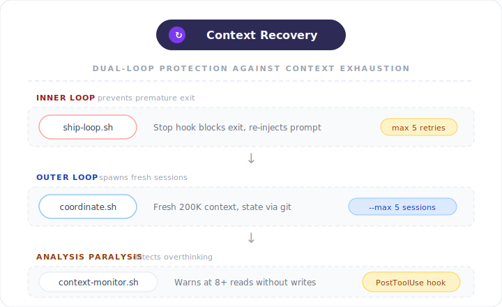
</p>

| Layer | Mechanism | Guards against |
|---|---|---|
| **Inner loop** | [`ship-loop.sh`](hooks/handlers/ship-loop.sh) Stop hook — blocks exit with JSON re-feed, session-isolated, transcript-based promise detection (max 5x) | Claude giving up mid-pipeline |
| **Outer loop** | [`scripts/coordinate.sh`](scripts/coordinate.sh) — spawns fresh sessions with clean context | Context window filling up |
| **Analysis paralysis** | [`context-monitor.sh`](hooks/handlers/context-monitor.sh) — warns at 8+ consecutive reads without writes | Reading without producing |
| **Risk scoring** | Per-subagent risk accumulation — halt at >20% or 50+ file changes | Runaway subagents |

```bash
# Full autonomous sprint with context recovery
./scripts/coordinate.sh "Build the authentication module" --max 5 --convergence deep --team
```

### Key constraints

- `TASKS.md` is never modified directly during review — changes must be proposed in [`MEMORY.md`](ops/MEMORY.md) first
- Neither [Gemini](https://github.com/google-gemini/gemini-cli) nor [Codex](https://github.com/openai/codex) may modify source code; they only write to their designated `ops/` files
- Parallel reviews are safe because agents write to separate files
- Maximum 3 review cycles per sprint before escalating to user
- Phase 0 can be skipped for small bug fixes, same-session continuations, or unchanged codebases (use [`/quick`](commands/quick.md))
- Completion requires `<promise>DONE</promise>` after [verification checklist](skills/verification-before-completion/SKILL.md) passes

---

## How it compares

This framework was informed by analyzing the [Claude Code Blueprint](https://github.com/Ninety2UA/claude-code-blueprint) and selectively adopting patterns that complement our heterogeneous multi-model architecture.

| Dimension | [Claude Code Blueprint](https://github.com/Ninety2UA/claude-code-blueprint) | This framework |
|---|---|---|
| **Agent model** | Homogeneous (Claude-only) | Heterogeneous (Claude + Gemini + Codex) |
| **Review agents** | 6 Claude subagents | 7 reviewers (2 external + 5 Claude subagents) |
| **Codebase analysis** | Claude subagent | [Gemini CLI](https://github.com/google-gemini/gemini-cli) (1M token context) |
| **Test execution** | Claude subagent | [Codex CLI](https://github.com/openai/codex) (sandboxed execution) |
| **Coordination** | Native subagents + git | File protocol + bash + subagents + teams |
| **Skills** | Claude-only | Portable across all 3 CLIs via [injection](#portable-skill-injection) |
| **Dependencies** | Zero (markdown only) | Three CLIs (Claude + Gemini + Codex) |

<details>
<summary><strong>What we adopted from Blueprint</strong></summary>

Confidence tiering, suppressions lists, review synthesis, wave orchestration, quality gates, institutional knowledge compounding, dual-loop context management, risk scoring, completion promise pattern, shadow path tracing, session continuity. Ship-loop hook architecture: JSON `{decision, reason, systemMessage}` output, session isolation, transcript-based promise detection, atomic state updates, rich YAML frontmatter state file.
</details>

<details>
<summary><strong>What we added beyond Blueprint</strong></summary>

Multi-model coordination, portable skill injection into external agents, agent teams as a build mode, Gemini Phase 0 analysis with 1M token context, Codex sandboxed testing, file-based coordination protocol for cross-model state sharing.
</details>

---

## When NOT to use this framework

| Situation | What to do instead |
|---|---|
| Trivial task (< 30 minutes) | Just use Claude Code directly, or [`/quick`](commands/quick.md) |
| Pure exploration / brainstorming | Single agent conversation |
| Tight deadline, no tests needed | Claude Code solo, skip review + test |
| Non-code deliverables | [Gemini CLI](https://github.com/google-gemini/gemini-cli) solo with its large context |

---

## FAQ

<details>
<summary><strong>Can I use this with an existing project?</strong></summary>

Yes. Use Option 2 or Option 3 from <a href="#installation">Installation</a> to copy just the components you need. The framework is additive — it doesn't modify your existing code.
</details>

<details>
<summary><strong>Do I need all three CLIs?</strong></summary>

No. The framework degrades gracefully. Without Gemini, Phase 0 is skipped. Without Codex, testing is handled by Claude. You lose the multi-model benefits but everything still works.
</details>

<details>
<summary><strong>Do I need all the skills?</strong></summary>

No. Skills activate contextually. If you never use TDD, the <a href="skills/test-driven-development/SKILL.md">test-driven-development</a> skill won't activate. You can delete any skill directory you don't want.
</details>

<details>
<summary><strong>How do agents differ from skills?</strong></summary>

<strong>Skills</strong> are instructions that guide an agent's behavior — methodology documents. <strong>Agents</strong> are separate subprocesses dispatched via the Agent tool, each with their own context window. Skills can be injected into any agent (including external ones like Gemini and Codex).
</details>

<details>
<summary><strong>What are Agent Teams?</strong></summary>

<a href="agents/team-lead.md">Agent Teams</a> spawn multiple Claude Code instances that collaborate through a shared task list and messaging. Unlike review swarms (read-only analysis), Agent Teams are peers that divide file ownership and coordinate builds. Enable with <code>CLAUDE_CODE_EXPERIMENTAL_AGENT_TEAMS: "1"</code> in settings.json.
</details>

<details>
<summary><strong>Do small bug fixes need the full pipeline?</strong></summary>

No. Use <a href="commands/quick.md"><code>/quick</code></a> for changes touching fewer than 3 files. It skips Phase 0, plan validation, and the full review swarm.
</details>

<details>
<summary><strong>How does context exhaustion recovery work?</strong></summary>

Two layers. <strong>Inside</strong> a session, <a href="hooks/handlers/ship-loop.sh"><code>ship-loop.sh</code></a> blocks premature exit — it reads the session transcript, checks for <code>&lt;promise&gt;DONE&lt;/promise&gt;</code>, and if not found, re-injects the original goal as a JSON response <code>{decision, reason, systemMessage}</code> (max 5 iterations, session-isolated). <strong>Outside</strong> a session, <a href="scripts/coordinate.sh"><code>coordinate.sh</code></a> spawns fresh Claude processes with clean context windows, with state persisting via git.
</details>

<details>
<summary><strong>What is knowledge compounding?</strong></summary>

After solving a non-trivial problem, <a href="commands/compound.md"><code>/compound</code></a> saves it as a structured document in <a href="ops/solutions/"><code>ops/solutions/</code></a>. Future <a href="commands/plan.md"><code>/plan</code></a> and <a href="commands/deep-research.md"><code>/deep-research</code></a> commands automatically search this directory before starting new work — so every sprint gets smarter.
</details>

---

## Recent changes

### 2026-03-31 — v2.0.0: Claude Code plugin conversion

The framework was converted from a `git clone` + manual copy installation to a **Claude Code plugin**. This is a breaking change in how you install and update the framework.

- **Install:** `claude plugin add https://github.com/Ninety2UA/multi-agent-framework`
- **Update:** `claude plugin update multi-agent-framework`
- All components moved to root level (`agents/`, `skills/`, `commands/`, `hooks/`)
- Plugin manifest at `.claude-plugin/plugin.json` (v2.0.0)
- Hook registration via `hooks/hooks.json` with `${CLAUDE_PLUGIN_ROOT}` paths
- Root `settings.json` for env vars (`CLAUDE_CODE_EXPERIMENTAL_AGENT_TEAMS`)
- Session-start hook bootstraps `ops/` directory + copies skeleton templates on first run
- CLAUDE.md template provided at `templates/CLAUDE.md` for user projects
- All skill injection paths use `${CLAUDE_PLUGIN_ROOT}/skills/` (8 files updated)
- `docs/multi-agent-framework.md` updated: plugin layout, hooks.json config, removed stale settings block
- Solution docs updated for plugin hook system

### 2026-03-31 — Four-pass audit and Blueprint alignment

Four full audit passes (**20 parallel agents** + manual 11-point verification) reviewed all 49 framework components (3 hooks, 16 commands, 12 skills, 18 agents). Each pass caught issues the previous missed — converging to zero remaining defects.

| Pass | Found | Fixed |
|---|---|---|
| 1st (5 agents) | 4 critical, 10 high, ~20 medium | Hooks stdin parsing, README config, coordinate.md guard, all high+medium |
| 2nd (5 agents) | 1 critical, 8 high, 4 medium | JSON injection, PID captures, path consistency, reviewer coverage |
| 3rd (5 agents) | 3 critical, 7 high, 6 medium | mkdir .claude in hooks, stale docs, deep-research PID, ops refs |
| 4th (5 agents + manual) | 1 high | ship-loop.sh mkdir guard (last hook missing it) |

<details>
<summary><strong>Critical fixes</strong></summary>

- **Hooks were completely non-functional** — both `ship-loop.sh` and `context-monitor.sh` read environment variables (`$CLAUDE_STOP_ASSISTANT_MESSAGE`, `$CLAUDE_TOOL_NAME`) that Claude Code does not set. Hook data arrives via stdin JSON. Both hooks now parse stdin correctly. This means completion detection and analysis paralysis detection were silently broken since the framework's creation.
- **README shipped broken hook config** — the Getting Started section used the flat `{ "command", "timeout" }` format that Claude Code rejects. Migrated to the correct `{ "matcher", "hooks": [{ "type": "command", "command" }] }` format.
- **`/coordinate` ran full sprints unguarded** — the command executed Phase 0–6 without activating the ship-loop Stop hook, so context exhaustion could silently kill mid-sprint. Now creates the state file and emits `<promise>DONE</promise>` on completion.
- **Ship-loop JSON injection** (found in second pass) — the heredoc embedded raw `$PROMPT_TEXT` into JSON output. Any goal containing double quotes or newlines produced malformed JSON, silently breaking the Stop hook. Now uses `python3 json.dumps()` for safe encoding.
</details>

<details>
<summary><strong>Ship-loop rewrite (Blueprint alignment)</strong></summary>

The Stop hook was rewritten to match the [Claude Code Blueprint](https://github.com/Ninety2UA/claude-code-blueprint)'s architecture:

| Before | After |
|---|---|
| Plain text output | JSON `{decision, reason, systemMessage}` |
| No session isolation | Session-isolated via `session_id` matching |
| Basic stdin grep for promise | Transcript-based JSONL promise detection |
| `sed -i.bak` state updates | Atomic temp file + `mv` |
| No input validation | Integer validation + `set -euo pipefail` |
| Simple 2-field state file | Rich frontmatter: `active`, `session_id`, `iteration`, `max_iterations`, `completion_promise` + prompt body |
| Raw shell variable in JSON | `python3 json.dumps()` for safe JSON encoding |
</details>

<details>
<summary><strong>High-severity fixes</strong></summary>

- **`session-start.sh`** now cleans stale `context-monitor.local.md` on startup (was documented but never implemented)
- **`build.md`** replaced hardcoded `src/auth/` paths with `<scope>` placeholders in agent team examples
- **`deep-research.md`** Gemini invocation now injects `codebase-mapping` skill (was the only Gemini call without it)
- **`review.md`** added `wait $GEMINI_PID $CODEX_PID` before synthesis (was racing on incomplete review files)
- **`test.md`** Codex invocation now uses proper `> /tmp/... 2>&1 &` redirect + PID capture pattern
- **`security-sentinel.md`** removed unnecessary Bash tool (least-privilege for static analysis)
- **`team-lead.md`** added structured output format (was the only agent without one)
- **`wave-orchestration`** skill flagged team mode as Claude-specific + experimental
- **`review.md --full`** now includes `architecture-strategist` (was designed for Phase 3 but never wired in)
- **`build.md`** agent team bash block now captures PIDs and waits (was fire-and-forget)
- **`ship.md`**, **`plan.md`**, **`coordinate.md`** Phase 0 Gemini invocations now capture `GEMINI_PID` and `wait` (were backgrounded with no wait)
- **`coordinate.md`** Phase 3 now includes all 5 review agents (was missing `convention-enforcer` and `architecture-strategist`)
- **`pr-comment-resolver.md`** now checks `gh auth status` before fetching PR comments (was a hard failure if `gh` CLI unavailable)
- **All 3 hook scripts** now have `mkdir -p .claude` guards for project-local state files (`.claude/` dir no longer exists after plugin migration)
- **`deep-research.md`** added `GEMINI_PID` capture + `wait` for background Gemini process
- **`docs/multi-agent-framework.md`** rewrote repo tree + settings section for plugin layout (was still showing old structure)
- **`ops/solutions/settings-json`** updated for plugin `hooks/hooks.json` approach
- **Stale comment cleanup** in hook script headers (referenced old `.claude/settings.json`)
</details>

<details>
<summary><strong>Medium-severity fixes</strong></summary>

- Fixed missing `ops/` path prefixes across `ship.md`, `plan.md`, `quick.md`, `coordinate.md`
- `plan-checker.md` now accepts "Claude subagent" as a valid assignment category
- `git-history-analyzer.md` replaced interactive `git bisect` with non-interactive `git log -S` alternative
- `deployment-verifier.md` added explicit "never execute rollbacks" safety rule
- `session-start.sh` replaced `echo -e` with POSIX-portable `printf '%b\n'`
- Fixed bare `ops/` path prefixes in `debug.md`, `review.md`, `coordinate.md`
- `status.md` now lists all 16 commands (was missing `/coordinate`, `/analyze`, `/resolve-pr`)
- `coordinate.md` Phase 5 now specifies max 3 fix cycles (was open-ended)
- Standardized archive path wording to `[today's date]` across `ship.md` and `coordinate.md`
</details>

Documented solutions: [`ops/solutions/2026-03-31-hooks-stdin-json-parsing.md`](ops/solutions/2026-03-31-hooks-stdin-json-parsing.md)

### Verification

The framework has been validated through:
- **20 parallel audit agents** across 4 passes (hooks, commands, skills, agents, infrastructure)
- **Manual 11-point verification**: bash syntax, JSON validity, stale path scans, file counts, skill injection paths, executable permissions, mkdir guards, stdin parsing, agent cross-references, plugin hook paths, state file template compatibility
- All checks pass. Runtime behavior (plugin installation, hook firing, `${CLAUDE_PLUGIN_ROOT}` expansion) requires live testing via `claude --plugin-dir .`

---

## License

MIT

---

<p align="center">
  <sub>Built for teams that believe AI-assisted development should get better with every sprint.</sub>
</p>

<p align="center">
  <a href="docs/multi-agent-framework.md">Full Documentation</a> ·
  <a href="CLAUDE.md">CLAUDE.md</a> ·
  <a href="https://github.com/google-gemini/gemini-cli">Gemini CLI</a> ·
  <a href="https://github.com/openai/codex">Codex CLI</a>
</p>
