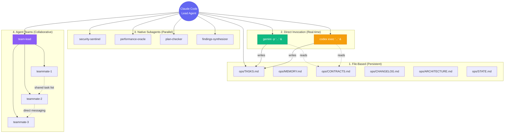
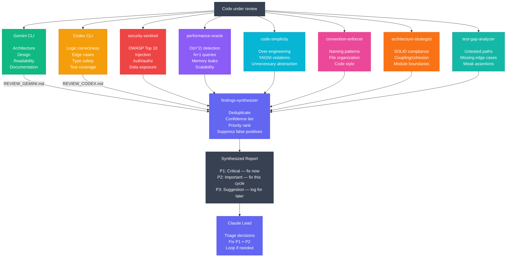
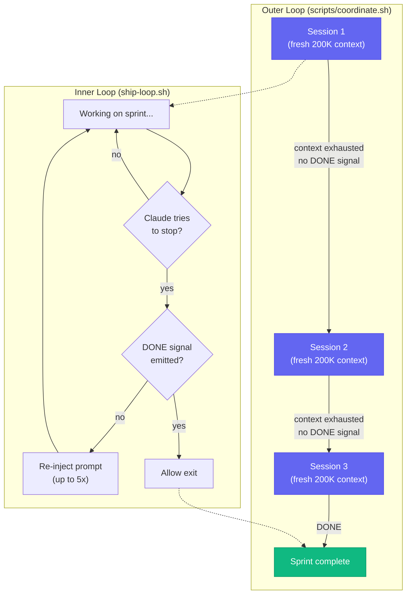
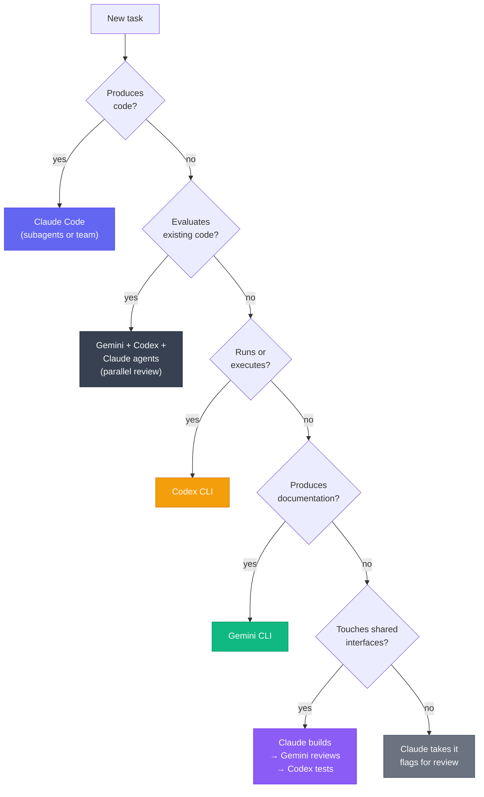

<div align="center">

```
 _____ _                 _        _____          _        _____
|     | |___ _ _ _| |___   |     |___ _| |___   |   __|___ _ _ _ ___
|   --| | .'| | | . | -_|  |   --| . | . | -_|  |   __| .'|_'_| | | |
|_____|_|__,|___|___|___|  |_____|___|___|___|  |__|  |__,|_,_|___|_|

 _____     _ _   _       _____               _
|     |_ _| | |_|_|_____|  _  |___ ___ ___| |_
| | | | | | |  _| |_____|     | . | -_|   |  _|
|_|_|_|___|_|_| |_|     |__|__|_  |___|_|_|_|
                               |___|
 _____                                     _
|   __|___ ___ _____ ___ _ _ _ ___ ___| |_
|   __|  _| .'|     | -_| | | | . |  _| '_|
|__|  |_| |__,|_|_|_|___|_____|___|_| |_,_|
```

<h3>A hybrid multi-agent coordination framework where Claude Code orchestrates<br>Gemini CLI, Codex CLI, and specialized subagents through file-based protocols,<br>portable skills, and parallel review swarms.</h3>

<br>

**18 Agents** &nbsp;&bull;&nbsp; **12 Skills** &nbsp;&bull;&nbsp; **16 Commands** &nbsp;&bull;&nbsp; **3 Hooks** &nbsp;&bull;&nbsp; **4 Coordination Modes**

<br>

[Getting Started](#-getting-started) &nbsp;&bull;&nbsp; [Architecture](#-architecture) &nbsp;&bull;&nbsp; [Commands](#-commands) &nbsp;&bull;&nbsp; [Skills](#-skills) &nbsp;&bull;&nbsp; [Agents](#-agents)

</div>

---

## What is this?

A production-grade framework that turns Claude Code into a **lead agent** coordinating multiple AI systems. Instead of using one model for everything, this framework assigns each model to what it does best:

- **Claude Code (Opus)** builds features and orchestrates the entire workflow
- **Gemini CLI** performs full-codebase analysis using its 1M token context window
- **Codex CLI** runs tests, security audits, and infrastructure tasks in sandboxed environments
- **Claude specialized agents** provide deep expertise in security, performance, architecture, and more

Every interaction between agents follows a structured protocol. Work is tracked in shared markdown files. Reviews run in parallel. Knowledge compounds across sessions.

### Core philosophy

> Each sprint should make the next sprint easier — not harder.

The framework achieves this through **institutional knowledge compounding**: every non-trivial problem solved gets documented in `ops/solutions/`, every architectural decision in `ops/decisions/`, and a `learnings-researcher` agent automatically searches these before planning new work.

---

## Architecture

### Four coordination modes



| Mode | Mechanism | When to use |
|---|---|---|
| **File-based** | Shared markdown files in `ops/` | Persistent state across sessions, audit trails |
| **Direct invocation** | `gemini -p` / `codex exec` via bash | Real-time external agent delegation |
| **Native subagents** | Claude's Agent tool with `.claude/agents/` definitions | Parallel focused tasks, review swarms |
| **Agent teams** | Multi-Claude instances with shared task lists | Complex builds with 5+ interdependent tasks |

### Portable skill injection

Skills are model-agnostic markdown files that ANY agent can consume:

```bash
# Claude uses skills natively
# Gemini receives skills via prompt injection
gemini -p "$(cat .claude/skills/codebase-mapping/SKILL.md) Analyze the full codebase..."

# Codex receives skills the same way
codex exec "$(cat .claude/skills/test-driven-development/SKILL.md) Write tests for..."
```

This decouples *what methodology to use* from *which model executes it*.

---

## Sprint lifecycle

Every goal flows through a structured lifecycle. Each phase has dedicated commands, skills, and agents.

```mermaid
flowchart LR
    P0["Phase 0\nAnalyze"] --> PRE["Pre-Plan\nResearch"]
    PRE --> P1["Phase 1\nPlan"]
    P1 --> P15["Phase 1.5\nValidate"]
    P15 --> P2["Phase 2\nBuild"]
    P2 --> P3["Phase 3\nReview"]
    P3 --> P4["Phase 4\nSynthesize"]
    P4 -->|"not converged\n(max 3x)"| P3
    P4 --> P5["Phase 5\nTest"]
    P5 --> P6["Phase 6\nWrap"]

    style P0 fill:#10b981,stroke:#059669,color:#fff
    style PRE fill:#6366f1,stroke:#4f46e5,color:#fff
    style P1 fill:#6366f1,stroke:#4f46e5,color:#fff
    style P15 fill:#8b5cf6,stroke:#7c3aed,color:#fff
    style P2 fill:#6366f1,stroke:#4f46e5,color:#fff
    style P3 fill:#f59e0b,stroke:#d97706,color:#fff
    style P4 fill:#6366f1,stroke:#4f46e5,color:#fff
    style P5 fill:#f59e0b,stroke:#d97706,color:#fff
    style P6 fill:#6366f1,stroke:#4f46e5,color:#fff
```



| Phase | Agent(s) | Command | What happens |
|---|---|---|---|
| **0 — Analyze** | Gemini + `codebase-mapping` skill | `/plan` | Full-repo scan: architecture, patterns, contracts, technical debt |
| **Pre-Plan** | `learnings-researcher` | `/plan`, `/deep-research` | Search institutional knowledge for relevant past solutions |
| **1 — Plan** | Claude + `writing-plans` skill | `/plan` | Decompose goal into tasks with shadow paths, error maps, wave grouping |
| **1.5 — Validate** | `plan-checker` agent | `/plan` | Validate assignments, dependencies, scope, shadow path coverage |
| **2 — Build** | Claude subagents or agent teams | `/build` | Wave orchestration with integration verification between waves |
| **3 — Review** | Gemini + Codex + Claude review agents | `/review` | Up to 8 parallel reviewers analyze code simultaneously |
| **4 — Synthesize** | `findings-synthesizer` agent | `/review` | Merge, deduplicate, confidence-tier, priority-rank all findings |
| **5 — Test** | Codex + `test-driven-development` skill | `/test` | TDD test writing, gap analysis, fix cycle until green |
| **6 — Wrap** | Claude + `knowledge-compounding` skill | `/wrap` | Document solutions, archive reviews, write STATE.md |

---

## Parallel review architecture

The framework's most sophisticated mechanism. Up to 8 reviewers analyze the same code simultaneously through different lenses:



### Confidence tiering

Every finding gets a confidence score to prevent wasting time on phantom issues:

| Tier | Criteria | Rule |
|---|---|---|
| **HIGH** | Verified in codebase via grep/read. Deterministic. | Can be any priority |
| **MEDIUM** | Pattern-aggregated detection. Some false positive risk. | Can be any priority |
| **LOW** | Requires intent verification. Heuristic-only. | **Can NEVER be P1** |

### Suppressions

Each reviewer has a "Do Not Flag" list to reduce noise:
- Readability-aiding redundancy (explicit types where inference works)
- Documented threshold values with clear context
- Sufficient test assertions for the behavior being tested
- Consistency-only style changes matching project convention
- Issues already addressed in the current diff

---

## Context management

### Dual-loop context exhaustion recovery

Two defense mechanisms prevent long sprints from dying to context limits:



| Layer | Mechanism | Guards against |
|---|---|---|
| **Inner loop** | `ship-loop.sh` Stop hook | Claude giving up mid-pipeline |
| **Outer loop** | `scripts/coordinate.sh` bash wrapper | Context window filling up |
| **Analysis paralysis** | `context-monitor.sh` PostToolUse hook | 8+ consecutive reads without writing code |
| **Risk scoring** | Per-subagent risk accumulation | Runaway subagents (halt at >20% risk or 50+ file changes) |

---

## Quality gates

Five non-negotiable checkpoints enforced at every stage:

| # | Gate | Enforcement | Failure mode |
|---|---|---|---|
| 1 | **Plan validated before build** | `plan-checker` agent reviews TASKS.md (max 3 iterations) | Build cannot start until APPROVED |
| 2 | **Failing test before code** | `test-driven-development` skill enforces RED-GREEN-REFACTOR | No production code without demand |
| 3 | **Root cause before fix** | `systematic-debugging` skill requires diagnosis | No symptom-level patches |
| 4 | **Evidence before completion** | `verification-before-completion` skill requires checklist | No "done" without proof |
| 5 | **Review before ship** | Parallel review swarm, max 3 cycles | No merge without review |

---

## Getting started

### Prerequisites

You need all three CLIs installed and authenticated:

```bash
# Claude Code (you're probably already here)
claude --version

# Gemini CLI — install and authenticate
npm install -g @anthropic-ai/gemini-cli  # or Google's official package
gemini -p "Respond with only: READY"     # verify non-interactive mode

# Codex CLI — install and authenticate
npm install -g @openai/codex
codex exec "Respond with only: READY"    # verify non-interactive mode
```

### Installation

#### Option 1: Clone the framework

```bash
git clone https://github.com/YOUR_USER/multi-agent-framework.git
cd multi-agent-framework
```

#### Option 2: Add to an existing project

Copy the framework files into your project:

```bash
# Copy the coordination infrastructure
cp -r multi-agent-framework/.claude/ your-project/.claude/
cp -r multi-agent-framework/ops/ your-project/ops/
cp -r multi-agent-framework/scripts/ your-project/scripts/
cp multi-agent-framework/CLAUDE.md your-project/CLAUDE.md
```

#### Option 3: Claude-only (minimal)

If you only want the skills and agents without Gemini/Codex integration:

```bash
cp -r multi-agent-framework/.claude/ your-project/.claude/
```

### Configuration

Add to `.claude/settings.json`:

```json
{
  "env": {
    "CLAUDE_CODE_EXPERIMENTAL_AGENT_TEAMS": "1"
  },
  "hooks": {
    "SessionStart": [
      { "command": ".claude/hooks/session-start.sh", "timeout": 5000 }
    ],
    "Stop": [
      { "command": ".claude/hooks/ship-loop.sh", "timeout": 10000 }
    ],
    "PostToolUse": [
      { "command": ".claude/hooks/context-monitor.sh", "timeout": 5000 }
    ]
  }
}
```

### Verify installation

```bash
# Start Claude Code in your project
claude

# Check available commands
/status

# You should see:
# "Multi-agent framework ready."
# "Commands: /ship /plan /build /review /test /debug /quick ..."
```

---

## Commands

### Full pipeline

| Command | What it does |
|---|---|
| `/ship <goal>` | Fully autonomous end-to-end sprint with inner loop guard. Won't stop until done. |
| `/coordinate <goal>` | Same as /ship but without the exit guard — you can stop and resume manually. |

### Phase-specific

| Command | Phase | What it does |
|---|---|---|
| `/plan <goal>` | 0 → 1.5 | Analyze codebase, plan with shadow paths, validate via plan-checker |
| `/build [--team]` | 2 | Wave orchestration build. `--team` for agent team mode. |
| `/review [--full]` | 3 → 4 | Parallel review + synthesis. `--full` for all 8 reviewers. |
| `/test [scope]` | 5 | Gap analysis + Codex TDD. `--gaps-only` to just identify gaps. |
| `/wrap` | 6 | Compound knowledge, archive reviews, write STATE.md. |

### Lightweight workflows

| Command | What it does |
|---|---|
| `/quick <change>` | For changes touching < 3 files. Skips heavy machinery. |
| `/debug <bug>` | Structured debugging: reproduce, diagnose, fix with root cause analysis. |

### Research

| Command | What it does |
|---|---|
| `/deep-research <topic>` | Launch 5 parallel research agents + synthesizer. Use before planning complex features. |
| `/analyze <url>` | Deep compatibility analysis of an external repo against your system. |

### Session management

| Command | What it does |
|---|---|
| `/status` | Sprint overview: phase, tasks, blockers, available commands. |
| `/pause` | Quick checkpoint to STATE.md (no archiving, no summary). |
| `/resume` | Continue from STATE.md checkpoint. |
| `/compound` | Document a solved problem or architectural decision. |
| `/resolve-pr <PR#>` | Read GitHub PR comments and implement requested changes. |

---

## Skills

12 portable, model-agnostic workflow modules:

| Skill | Primary consumer | What it teaches the agent |
|---|---|---|
| `codebase-mapping` | Gemini (Phase 0) | Full-repo analysis: structure, data flow, patterns, debt, interfaces |
| `writing-plans` | Claude (Phase 1) | Task decomposition with shadow paths, error maps, interface context |
| `shadow-path-tracing` | Claude (Phase 1) | Enumerate every failure path alongside the happy path |
| `wave-orchestration` | Claude (Phase 2) | Dependency-grouped parallel execution with integration checks |
| `test-driven-development` | Codex (Phase 5) | RED-GREEN-REFACTOR: no production code without failing test |
| `systematic-debugging` | Codex, Claude | Error taxonomy, assumption tracking, bisection, root cause analysis |
| `iterative-refinement` | Claude (Phase 4) | Review-fix-review loops with convergence modes (fast/standard/deep) |
| `review-synthesis` | Claude (Phase 4) | Merge multi-reviewer findings with confidence tiering |
| `verification-before-completion` | All agents | Evidence-based completion checklist — no "done" without proof |
| `knowledge-compounding` | Claude (Phase 6) | Document solutions to ops/solutions/ for future sprints |
| `session-continuity` | Claude | Save/resume via STATE.md across sessions |
| `scope-cutting` | Claude | Systematically cut scope by unblocking value and risk |

---

## Agents

### Core workflow agents

| Agent | Phase | What it does |
|---|---|---|
| `plan-checker` | 1.5 | Validates task plans for completeness, assignment correctness, and dependency integrity |
| `findings-synthesizer` | 4 | Merges review outputs from all reviewers with deduplication and confidence tiering |
| `integration-verifier` | 2 | Runs build, tests, lint between waves — blocks next wave if failing |
| `learnings-researcher` | Pre-1 | Searches `ops/solutions/` and `ops/decisions/` for relevant past patterns |
| `team-lead` | 2 | Orchestrates agent team workers with file ownership and quality gates |
| `research-synthesizer` | 0 | Merges parallel research outputs into unified analysis |

### Review agents

| Agent | Lens | What it catches |
|---|---|---|
| `security-sentinel` | OWASP/Security | SQL injection, XSS, auth bypass, data exposure, dependency vulnerabilities |
| `performance-oracle` | Performance | O(n^2) loops, N+1 queries, memory leaks, scalability at 10x/100x/1000x |
| `code-simplicity-reviewer` | Complexity | Over-engineering, YAGNI violations, unnecessary abstractions |
| `convention-enforcer` | Conventions | Naming patterns, file organization, code style consistency |
| `architecture-strategist` | Structure | SOLID principles, coupling/cohesion, module boundary violations |
| `test-gap-analyzer` | Coverage | Untested code paths, missing edge cases, weak assertions |

### Research agents

| Agent | What it researches |
|---|---|
| `best-practices-researcher` | Industry-wide patterns, anti-patterns, and tradeoff analysis |
| `framework-docs-researcher` | Current documentation for specific frameworks and libraries |
| `git-history-analyzer` | Code evolution, contributors, and architectural decisions via git history |

### Verification agents

| Agent | What it verifies |
|---|---|
| `bug-reproduction-validator` | Validates bugs are reproducible before anyone tries to fix them |
| `deployment-verifier` | Post-deployment health checks, smoke tests, error rate monitoring |
| `pr-comment-resolver` | Reads GitHub PR review comments and implements requested changes |

---

## Project structure

```
your-project/
├── .claude/
│   ├── agents/                    # 18 specialized agent definitions
│   │   ├── plan-checker.md
│   │   ├── findings-synthesizer.md
│   │   ├── integration-verifier.md
│   │   ├── learnings-researcher.md
│   │   ├── team-lead.md
│   │   ├── research-synthesizer.md
│   │   ├── security-sentinel.md
│   │   ├── performance-oracle.md
│   │   ├── code-simplicity-reviewer.md
│   │   ├── convention-enforcer.md
│   │   ├── architecture-strategist.md
│   │   ├── test-gap-analyzer.md
│   │   ├── best-practices-researcher.md
│   │   ├── framework-docs-researcher.md
│   │   ├── git-history-analyzer.md
│   │   ├── bug-reproduction-validator.md
│   │   ├── deployment-verifier.md
│   │   └── pr-comment-resolver.md
│   ├── commands/                  # 16 slash commands
│   │   ├── ship.md                #   /ship — full autonomous pipeline
│   │   ├── coordinate.md          #   /coordinate — full cycle, manual control
│   │   ├── plan.md                #   /plan — analyze + plan + validate
│   │   ├── build.md               #   /build — wave orchestration
│   │   ├── review.md              #   /review — parallel review + synthesis
│   │   ├── test.md                #   /test — TDD testing
│   │   ├── wrap.md                #   /wrap — compound + archive + handoff
│   │   ├── quick.md               #   /quick — lightweight changes
│   │   ├── debug.md               #   /debug — structured debugging
│   │   ├── deep-research.md       #   /deep-research — research swarm
│   │   ├── analyze.md             #   /analyze — external repo analysis
│   │   ├── status.md              #   /status — sprint overview
│   │   ├── pause.md               #   /pause — quick checkpoint
│   │   ├── resume.md              #   /resume — continue from checkpoint
│   │   ├── compound.md            #   /compound — document a solution
│   │   └── resolve-pr.md          #   /resolve-pr — handle PR comments
│   ├── skills/                    # 12 portable skill modules
│   │   ├── codebase-mapping/
│   │   ├── writing-plans/
│   │   ├── shadow-path-tracing/
│   │   ├── wave-orchestration/
│   │   ├── test-driven-development/
│   │   ├── systematic-debugging/
│   │   ├── iterative-refinement/
│   │   ├── review-synthesis/
│   │   ├── verification-before-completion/
│   │   ├── knowledge-compounding/
│   │   ├── session-continuity/
│   │   └── scope-cutting/
│   └── hooks/                     # 3 lifecycle hooks
│       ├── session-start.sh       #   SessionStart — orientation on launch
│       ├── ship-loop.sh           #   Stop — inner loop guard
│       └── context-monitor.sh     #   PostToolUse — analysis paralysis detection
├── ops/                           # Shared coordination files
│   ├── TASKS.md                   #   Work queue with status tracking
│   ├── MEMORY.md                  #   Decisions, patterns, gotchas
│   ├── CHANGELOG.md               #   Audit trail with attribution
│   ├── CONTRACTS.md               #   Shared interface definitions
│   ├── ARCHITECTURE.md            #   System design (Gemini writes)
│   ├── AGENTS.md                  #   Master protocol for all agents
│   ├── GOALS.md                   #   High-level product goals
│   ├── CONVENTIONS.md             #   Code style and standards
│   ├── STATE.md                   #   Session continuity
│   ├── solutions/                 #   Documented solved problems
│   ├── decisions/                 #   Architecture decision records
│   └── archive/                   #   Archived review + test files
├── scripts/
│   └── coordinate.sh              # Outer loop for context exhaustion recovery
├── CLAUDE.md                      # Claude Code protocol (auto-read)
├── GEMINI.md                      # Gemini CLI protocol
└── CODEX.md                       # Codex CLI protocol
```

---

## Usage examples

### Full autonomous sprint

```bash
# Let it run — it won't stop until done
/ship Build the user authentication module with JWT tokens and refresh flow

# With specific flags
/ship Build auth --convergence deep --team
```

### Step-by-step sprint

```bash
# 1. Research the domain
/deep-research JWT authentication best practices for Node.js APIs

# 2. Plan the work
/plan Build user authentication with JWT tokens and refresh flow

# 3. Build it
/build --team

# 4. Review everything
/review --full

# 5. Test it
/test

# 6. Document and wrap up
/wrap
```

### Quick fix

```bash
/quick Fix the null pointer exception in src/auth/validate.ts line 45
```

### Debug a bug

```bash
/debug Users are getting 403 errors on the /api/settings endpoint despite being authenticated
```

### Context exhaustion recovery (bash)

```bash
# Spawns fresh Claude sessions when context fills up
./scripts/coordinate.sh "Build the dashboard module" --max 5 --convergence deep --team
```

---

## How it compares

This framework was informed by analyzing the [Claude Code Blueprint](https://github.com/Ninety2UA/claude-code-blueprint) and selectively adopting patterns that complement our heterogeneous multi-model architecture.

| Dimension | Claude Code Blueprint | This framework |
|---|---|---|
| **Agent model** | Homogeneous (Claude-only) | Heterogeneous (Claude + Gemini + Codex) |
| **Review agents** | 6 Claude subagents | 8 reviewers (2 external + 6 Claude subagents) |
| **Codebase analysis** | Claude subagent | Gemini CLI (1M token context) |
| **Test execution** | Claude subagent | Codex CLI (sandboxed execution) |
| **Coordination** | Native subagents + git | File-based protocol + bash invocation + subagents + teams |
| **Skills** | Claude-only | Portable across all 3 CLIs via prompt injection |
| **Dependencies** | Zero (markdown only) | Three CLIs (Claude + Gemini + Codex) |

**What we adopted:** Confidence tiering, suppressions lists, review synthesis, wave orchestration, quality gates, institutional knowledge compounding, dual-loop context management, risk scoring, completion promise pattern, shadow path tracing, session continuity.

**What we added:** Multi-model coordination, portable skill injection into external agents, agent teams as a build mode, Gemini Phase 0 analysis, Codex sandboxed testing.

---

## Assignment heuristic

How the lead agent decides which agent handles which task:



---

## When NOT to use this framework

| Situation | What to do instead |
|---|---|
| Trivial task (< 30 minutes) | Just use Claude Code directly |
| Pure exploration / brainstorming | Single agent conversation |
| Tight deadline, no tests needed | Claude Code solo, skip review + test |
| Non-code deliverables | Gemini solo with its large context |

---

## License

MIT

---

<div align="center">

Built for teams that believe AI-assisted development should get better with every sprint.

**[Documentation](docs/multi-agent-framework.md)** &nbsp;&bull;&nbsp; **[CLAUDE.md](CLAUDE.md)**

</div>
